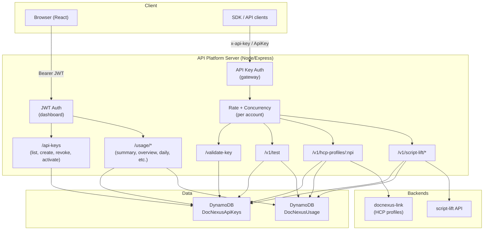
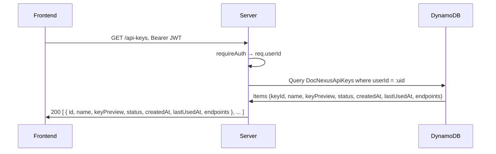
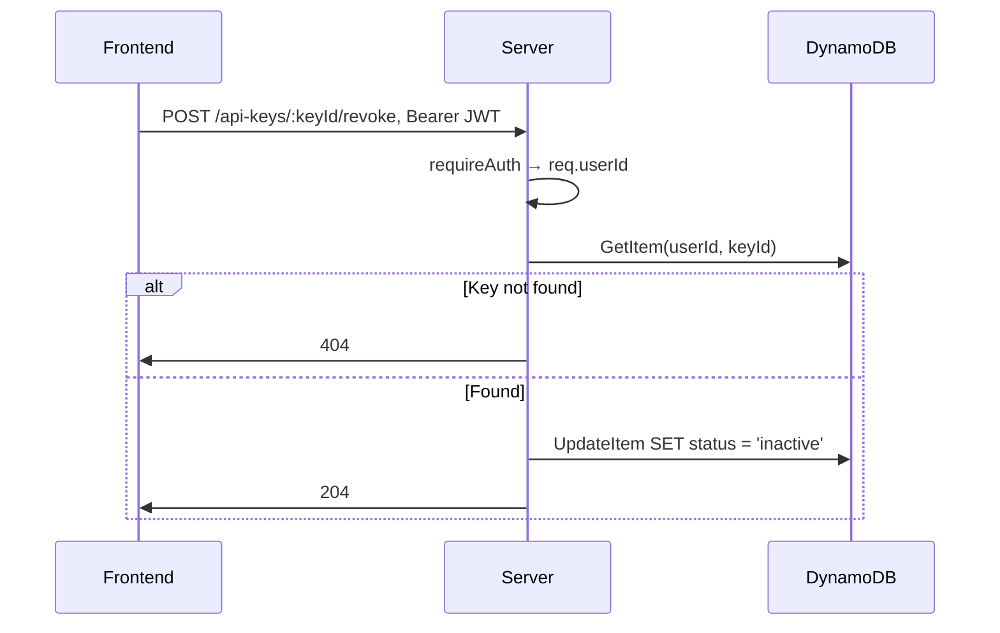
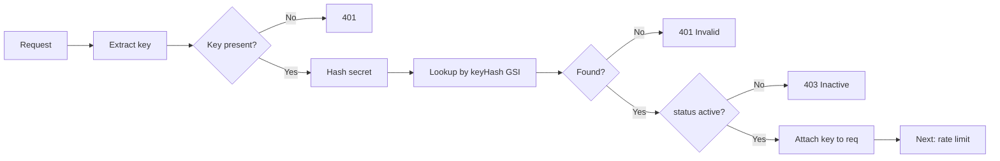
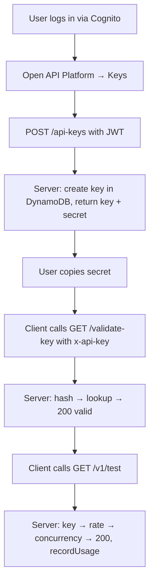
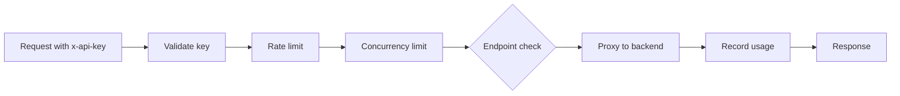
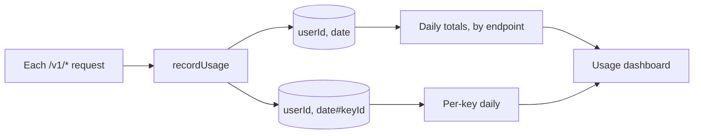

# API Key Platform — Project Specification

**Document version:** 1.0  
**Scope:** API key management, gateway (validate/test/proxy), usage tracking, dashboard UI, and SDK.  
**Status:** Implemented (local/dev); production checklist separate.

This document captures every design decision, flow, and minute detail for the API Key Platform.

---

## 1. Overview and scope

### 1.1 Purpose

- Allow **signed-in users** (Cognito) to **create, list, revoke, and activate** API keys.
- Expose a **gateway** that accepts requests authenticated by **API key** and either returns key metadata, or **proxies** to backends (docnexus-link for HCP profiles, script-lift for script-lift API).
- **Record usage** per user and per key for dashboard metrics.
- **Limit** request rate and concurrency **per account** (all keys for a user share limits).
- Provide a **dashboard UI** (Overview, API Keys, Usage, Documentation, Settings) and a **client SDK** for programmatic access.

### 1.2 In scope

| Item | Description |
|------|-------------|
| Key storage | DynamoDB table `DocNexusApiKeys`; key secret hashed (SHA-256), never stored in full. |
| Key lifecycle | Create (one-time secret), list, revoke (inactive), activate. |
| Gateway auth | API key via `x-api-key` or `Authorization: ApiKey <secret>`; validate-key and /v1/*. |
| Dashboard auth | Cognito JWT via `Authorization: Bearer <token>`; /api-keys, /usage/*. |
| Proxies | GET /v1/hcp-profiles/:npi → docnexus-link; ALL /v1/script-lift/* → script-lift. |
| Usage | Per user, per key, per day and per endpoint; stored in `DocNexusUsage`. |
| Rate limit | Per account, fixed 1-minute window, configurable max requests/minute. |
| Concurrency limit | Per account, max in-flight requests; 503 when exceeded. |
| Frontend | React (Vite), API Platform under `/api-platform`, mock mode when no backend URL. |
| SDK | TypeScript client: validateKey, test, getHcpProfile, scriptLift, raw; optional retry on 429/503. |

### 1.3 Out of scope (current)

- Key expiration (TTL).
- Scopes finer than “endpoints” (e.g. per-path permissions).
- Per-key rate/concurrency (only per account).
- JWKS verification of JWT (production requirement; see production checklist).
- Billing/quotas beyond usage display.

---

## 2. Architecture

### 2.1 High-level components



### 2.2 Decision: two authentication mechanisms

| Audience | Auth mechanism | Used for |
|----------|----------------|----------|
| Dashboard (human) | **Cognito JWT** (`Authorization: Bearer <token>`) | List/create/revoke/activate keys; all usage endpoints. |
| API clients (code) | **API key** (`x-api-key` or `Authorization: ApiKey <secret>`) | Validate key, /v1/test, /v1/hcp-profiles/*, /v1/script-lift/*. |

**Rationale:** Dashboard must identify the user (Cognito sub) to scope keys and usage. External callers (scripts, services) cannot use a short-lived JWT; a long-lived API key is standard and revocable.

### 2.3 Decision: single server for dashboard and gateway

Dashboard APIs and gateway APIs live on the **same Express server** (same port). Separation is by path and auth:

- Paths under `/api-keys` and `/usage/*` → require JWT.
- Paths `/validate-key`, `/v1/*` → require API key (no JWT).

**Rationale:** Simpler deployment and CORS; one base URL for frontend and SDK.

---

## 3. Data model

### 3.1 Table: DocNexusApiKeys

| Attribute | Type | Key | Description |
|-----------|------|-----|-------------|
| userId | String | Partition (HASH) | Cognito `sub` (owner). |
| keyId | String | Sort (RANGE) | Generated id, e.g. `dnx_<12 chars>`. |
| keyHash | String | GSI `keyHash-index` (HASH) | SHA-256(secret); used to validate requests. |
| keyPreview | String | — | Masked secret, e.g. `dnx_live***********abcd`. |
| name | String | — | User-defined label. |
| status | String | — | `active` \| `inactive`. |
| createdAt | String | — | ISO 8601. |
| lastUsedAt | String \| null | — | ISO 8601; updated on each use. |
| endpoints | List<String> | — | e.g. `["script-lift", "hcp-profiles"]`. |

**Decisions:**

- **Secret never stored:** Only `keyHash` is stored; lookup by hash to validate. Secret shown once on create.
- **keyId format:** `dnx_` + 12 chars (base64url) for readability and uniqueness.
- **Secret format:** `dnx_live` + 24 alphanumeric + 4 chars; high entropy, URL-safe.
- **GSI keyHash-index:** Enables “find key by hash” without knowing userId (required for gateway validation).

### 3.2 Table: DocNexusUsage

| Attribute | Type | Key | Description |
|-----------|------|-----|-------------|
| userId | String | Partition (HASH) | Cognito `sub`. |
| date | String | Sort (RANGE) | `YYYY-MM-DD` for daily rollup, or `YYYY-MM-DD#keyId` for per-key-per-day. |
| total | Number | — | Total requests that day (daily row). |
| test, hcpProfiles, scriptLift | Number | — | Per-endpoint counts (daily row). |
| totalLatencyMs | Number | — | Sum of latency (daily / per-key-day). |
| errors | Number | — | Error count. |
| keyId | String | — | Present on per-key-day rows. |
| requests | Number | — | Requests for that key that day (per-key-day row). |

**Decisions:**

- **Dual write on each request:** One row keyed by `userId + date` (daily aggregate), one by `userId + date#keyId` (per-key daily). Same request updates both.
- **Endpoint tags:** Normalized to `test`, `hcpProfiles`, `scriptLift` for attribute names.
- **No TTL:** Retention left to policy/separate job if needed.

---

## 4. Key lifecycle

### 4.1 Create key

**Trigger:** User clicks “Create key” in dashboard; optional name and endpoint selection.

**Flow:**

```mermaid
sequenceDiagram
  participant U as User
  participant F as Frontend
  participant S as Server
  participant D as DynamoDB

  U->>F: Create key (name, endpoints)
  F->>S: POST /api-keys, Bearer JWT, body: { name?, endpoints? }
  S->>S: requireAuth → req.userId (Cognito sub)
  S->>D: PutItem DocNexusApiKeys (userId, keyId, keyHash, keyPreview, name, status=active, createdAt, lastUsedAt=null, endpoints)
  Note over S: keyId = dnx_<12>, secret = dnx_live<24+4>, keyHash = SHA256(secret)
  S->>F: 201 { key: { id, name, keyPreview, status, createdAt, lastUsedAt, endpoints }, secret }
  F->>U: Show secret once; copy button
```

**Decisions:**

- **Default endpoints:** If omitted, `["script-lift", "hcp-profiles"]`.
- **Secret in response only:** Returned once in `createKey` response; not stored; not returned by list or any other API.
- **Status:** New keys are `active`.

### 4.2 List keys

**Trigger:** User opens API Keys page.

**Flow:**



**Decision:** Response is array of key objects; no `secret` or `keyHash` ever.

### 4.3 Revoke (deactivate) and activate

**Trigger:** User revokes or activates a key from the list.

**Flow:**



Activate is the same with `status = 'active'`.

**Decision:** Revoke/activate are idempotent; no error if already in that state (current implementation only updates status).

---

## 5. Gateway: API key validation and usage

### 5.1 Extracting the API key

**Decision:** Support two headers (checked in order):

1. `x-api-key: <secret>`
2. `Authorization: ApiKey <secret>` (trimmed)

If neither present or empty → 401.

**Code:** `getApiKeyFromRequest(req)` returns raw string or null.

### 5.2 Validation pipeline (per request)

For every gateway path that requires an API key (`/validate-key`, `/v1/test`, `/v1/hcp-profiles/:npi`, `/v1/script-lift/*`):



**Exception:** `/validate-key` does **not** apply rate or concurrency limits (so clients can check key validity without consuming limit).

### 5.3 Validate-key endpoint

**Purpose:** Let clients check if a key is valid and see its metadata without calling a “billable” endpoint.

| Aspect | Decision |
|--------|----------|
| Path | `GET /validate-key` |
| Auth | API key only (no JWT). |
| Rate/concurrency | **Not applied.** |
| 401 (no key) | `{ valid: false, error: "Missing x-api-key or ..." }` |
| 401 (invalid) | `{ valid: false, error: "Invalid or unknown API key" }` |
| 403 (inactive) | `{ valid: false, error: "API key is inactive", keyId }` |
| 200 | `{ valid: true, keyId, name, endpoints }` |

### 5.4 /v1/test endpoint

**Purpose:** Confirm key is accepted and that rate/concurrency apply; record one “test” usage.

**Pipeline:** requireValidApiKey → rateLimitByUser → concurrencyLimitByUser → handler.

**Handler:** Returns `{ message, keyId, name, endpoints }`; then **fire-and-forget** `recordUsage(userId, keyId, "test", { latencyMs, isError: false })`.

**Response headers:** `X-RateLimit-Remaining` set by rate limit middleware.

### 5.5 Proxy: /v1/hcp-profiles/:npi

**Purpose:** Proxy to docnexus-link’s US HCP profile by NPI.

**Decisions:**

- **Method:** GET only.
- **Endpoint check:** Key must have `hcp-profiles` in `endpoints`; else 403.
- **Backend URL:** `GATEWAY_DOCNEXUS_LINK_URL` or `DOCNEXUS_LINK_URL`; if unset → 503 with hint.
- **Backend auth:** Server obtains token via POST to `{base}/v5/token` with `GATEWAY_DOCNEXUS_USER` / `GATEWAY_DOCNEXUS_PASSWORD`, or uses `GATEWAY_DOCNEXUS_TOKEN` if set. Then GET `{base}/v5/profile/us/:npi` with `Authorization: Bearer <token>`.
- **Usage:** Record with tag `hcp-profiles`, latency, and isError (status >= 400).
- **Response:** Proxy status and body from docnexus-link; on proxy failure 502.

**Pipeline:** requireValidApiKey → rateLimitByUser → concurrencyLimitByUser → endpoint check → proxy → recordUsage.

### 5.6 Proxy: /v1/script-lift/*

**Purpose:** Proxy all methods and subpaths to script-lift backend.

**Decisions:**

- **Method:** ALL (GET, POST, etc.).
- **Subpath:** Path after `/v1/script-lift/` (or `/v1/script-lift`) plus query string forwarded.
- **Endpoint check:** Key must have `script-lift` in `endpoints`; else 403.
- **Backend URL:** `GATEWAY_SCRIPT_LIFT_URL` or `SCRIPT_LIFT_URL`; if unset → 503.
- **Forwarding:** Method, Content-Type, body (if not GET/HEAD), and optionally Authorization / x-api-key from request.
- **Usage:** Same pattern as HCP; tag `script-lift`.
- **Pipeline:** Same as HCP (key → rate → concurrency → endpoint check → proxy → recordUsage).

---

## 6. Rate limiting and concurrency

### 6.1 Scope: per account (userId)

**Decision:** Limits apply to **userId** (Cognito sub). All API keys belonging to that user share the same rate and concurrency limits.

**Rationale:** Prevents one user from creating many keys to bypass limits; simplifies product and implementation.

### 6.2 Rate limit algorithm

| Decision | Choice |
|----------|--------|
| Window | Fixed 1 minute (60_000 ms). |
| Counter | Increment at start of request; compare to max. |
| Reset | When `now - windowStart >= WINDOW_MS`, reset count and windowStart. |
| Config | `RATE_LIMIT_PER_USER_PER_MINUTE` (default 100). |
| When exceeded | 429, `Retry-After` (seconds until window end), body `{ error, message, retryAfterSec }`. |
| Header | Every response: `X-RateLimit-Remaining` (remaining in current window). |

**Storage:** In-memory `Map<userId, { count, windowStartMs }>`. For multi-instance production, use Redis or DynamoDB (see production checklist).

### 6.3 Concurrency limit algorithm

| Decision | Choice |
|----------|--------|
| Counter | In-flight requests per userId. |
| Increment | On entering handler (after rate limit check). |
| Decrement | On `res.on('finish')` or `res.on('close')` (whichever first; single decrement). |
| Config | `MAX_CONCURRENT_REQUESTS_PER_USER` (default 20). |
| When exceeded | 503, body `{ error, message, maxConcurrent }`. No `Retry-After` (client retries when in-flight drop). |

**Storage:** In-memory `Map<userId, number>`. For multi-instance, same shared store as rate limit.

### 6.4 Middleware order

For `/v1/test`, `/v1/hcp-profiles/:npi`, `/v1/script-lift/*`:

1. **requireValidApiKey** — resolve key, set `req.apiKey` (includes `userId`).
2. **rateLimitByUser** — check/increment rate; if over limit → 429 and stop.
3. **concurrencyLimitByUser** — increment in-flight; if over limit → 503 and stop; else register finish/close to decrement.
4. **Route handler** — run business logic and recordUsage.

---

## 7. Usage recording

### 7.1 When usage is recorded

- **/v1/test** — after sending response; tag `test`.
- **/v1/hcp-profiles/:npi** — after proxy response; tag `hcp-profiles`; isError = (status >= 400).
- **/v1/script-lift/*** — same; tag `script-lift`.

**Decision:** Fire-and-forget `recordUsage(...).catch(...)` so slow DynamoDB does not block response.

### 7.2 What is written

- **DocNexusApiKeys:** `lastUsedAt` updated to now (UpdateItem).
- **DocNexusUsage:**  
  - One UpdateItem: key `(userId, date)` (daily): increment `total`, endpoint tag counter, `totalLatencyMs`, `errors`.  
  - One UpdateItem: key `(userId, date#keyId)` (per-key-day): set `keyId`, increment `requests`, `totalLatencyMs`, `errors`.

**Decision:** Use DynamoDB atomic increments (`if_not_exists(#x, :zero) + :one`) so concurrent requests are safe.

### 7.3 Usage endpoints (dashboard)

All require **Bearer JWT**. Return data scoped to `req.userId`.

| Endpoint | Purpose |
|----------|---------|
| GET /usage/summary | Requests today/month, change %, avg latency, success rate, estimated cost, monthly limit. |
| GET /usage/overview | Aggregates: totalRequests, activeKeys, totalKeys, avgLatencyMs, successRatePercent. |
| GET /usage/daily-requests?days=N | Array of { date, requests } for last N days (max 90). |
| GET /usage/top-endpoints | Per-endpoint request counts (last 30 days). |
| GET /usage/by-key | Per-key requests, errors, avgLatencyMs, lastUsed (human string). |
| GET /usage/activity?limit=N | Recent activity from keys’ lastUsedAt (max 50). |

**Decision:** Summary and overview compute from DocNexusUsage by scanning last 30/60 days of rows for the user; no separate analytics DB in current scope.

---

## 8. Dashboard (frontend)

### 8.1 Routes and pages

| Route | Page | Purpose |
|-------|------|---------|
| /api-platform | (layout) | AuthGuard + ApiPlatformLayout. |
| /api-platform (index) | OverviewPage | KPIs, chart, recent activity. |
| /api-platform/keys | ApiKeysPage | List keys, create, revoke, activate, copy secret. |
| /api-platform/usage | UsagePage | Usage charts and by-key. |
| /api-platform/documentation | DocumentationPage | Getting started, code samples. |
| /api-platform/settings | SettingsPage | Profile, notifications, security (no 2FA in scope). |

**Decision:** All under `/api-platform` and protected by AuthGuard (Cognito); no public API Platform routes.

### 8.2 Backend vs mock

| Decision | Implementation |
|----------|----------------|
| When backend present | `VITE_API_PLATFORM_BASE_URL` set → all key and usage services call real server. |
| When backend absent | `getApiPlatformBaseUrl()` empty → `hasApiPlatformBackend()` false; list/create/revoke/activate and usage use **mock data** (localStorage for keys, hardcoded/mock for usage). |
| Rationale | Frontend can run and demo without server; keys “created” in mock mode are localStorage-only. |

### 8.3 Services

- **api-key-service:** listApiKeys, createApiKey, revokeApiKey, activateApiKey; getAuthHeaders() from Amplify fetchAuthSession (idToken).
- **usage-service:** getUsageSummary, getOverviewStats, getDailyRequests, getTopEndpoints, getUsageByKey, getRecentActivity; same auth.

**Decision:** Auth headers built once per request from Amplify; no refresh logic in these services (Amplify handles token refresh).

---

## 9. SDK

### 9.1 Design decisions

| Decision | Choice |
|----------|--------|
| Entry | `createDocNexusApiClient({ baseUrl, apiKey, retryOnLimit? })` returning a client instance. |
| Auth | Every request sends `x-api-key` and `Content-Type: application/json`. |
| Retry | Optional: on 429 or 503, wait `Retry-After` seconds then retry once. |
| Response shape | `{ data, status, rateLimitRemaining, headers }`; on non-2xx throw `DocNexusApiError` (status, message, body, retryAfterSec, rateLimitRemaining). |
| Environment | Works in browser and Node (fetch); no Node-only APIs. |

### 9.2 Methods

| Method | Server path | Notes |
|--------|-------------|--------|
| validateKey() | GET /validate-key | Returns `ValidateKeyResult`; no retry/limit. |
| test() | GET /v1/test | Uses retry if enabled; returns TestResult. |
| getHcpProfile(npi) | GET /v1/hcp-profiles/:npi | Returns ApiResponse<unknown>. |
| scriptLift(path, { method, body, query }) | ALL /v1/script-lift/:path | path = subpath after script-lift/. |
| raw(path, init) | Any path | Same auth and optional retry. |

### 9.3 Location and export

- **Implementation:** `src/lib/docnexus-api-sdk/index.ts`.
- **Re-export:** From `@/features/api-platform` for convenience.
- **Docs:** `src/lib/docnexus-api-sdk/README.md`.

---

## 10. Security decisions

| Decision | Detail |
|----------|--------|
| Secret storage | Only SHA-256(secret) stored; secret never persisted. |
| Secret in responses | Only in POST /api-keys response body once; never in list or usage. |
| Key lookup | By hash only; no lookup by plaintext. |
| JWT (dev) | Decode only (jose decodeJwt); **production must verify with JWKS** (see production checklist). |
| CORS | Current: `Access-Control-Allow-Origin` from request origin or `*`; **production:** restrict to allowed origins. |
| Credentials in env | No hardcoded production passwords; use secrets manager in production. |
| Body size | express.json() default limit; consider explicit limit in production. |

---

## 11. Error handling and status codes

| Code | When |
|------|------|
| 200 | Success (GET validate-key, /v1/test, proxy 200). |
| 201 | Key created (POST /api-keys). |
| 204 | Revoke/activate success. |
| 401 | Missing or invalid API key; missing or invalid JWT. |
| 403 | Key inactive; key does not have required endpoint. |
| 404 | Key not found (revoke/activate with wrong keyId or wrong user). |
| 429 | Rate limit exceeded (per account). |
| 502 | Proxy error (downstream unreachable or error). |
| 503 | Backend not configured (gateway URL unset); concurrency limit exceeded; optional health dependency down. |
| 500 | Unexpected server error (e.g. DynamoDB exception in auth). |

**Decision:** JSON error bodies include `error` (and often `message`, `keyId`, `retryAfterSec`, `maxConcurrent`, `hint`) for clients.

---

## 12. Configuration reference

### 12.1 Server (env)

| Variable | Default | Purpose |
|----------|---------|---------|
| PORT | 3001 | Server port. |
| DYNAMODB_ENDPOINT | — | Set for DynamoDB Local (e.g. http://localhost:8000). |
| AWS_REGION | ap-southeast-2 | AWS region (and DynamoDB). |
| API_KEYS_TABLE | DocNexusApiKeys | Keys table name. |
| USAGE_TABLE | DocNexusUsage | Usage table name. |
| GATEWAY_DOCNEXUS_LINK_URL | — | docnexus-link base URL. |
| GATEWAY_DOCNEXUS_USER / GATEWAY_DOCNEXUS_PASSWORD | (dev defaults) | Token for docnexus-link (or use GATEWAY_DOCNEXUS_TOKEN). |
| GATEWAY_DOCNEXUS_TOKEN | — | Fixed Bearer for docnexus-link (optional). |
| GATEWAY_SCRIPT_LIFT_URL | — | script-lift base URL. |
| RATE_LIMIT_PER_USER_PER_MINUTE | 100 | Max requests per minute per account. |
| MAX_CONCURRENT_REQUESTS_PER_USER | 20 | Max in-flight per account. |

### 12.2 Frontend (build-time)

| Variable | Purpose |
|----------|---------|
| VITE_API_PLATFORM_BASE_URL | API Platform server URL; empty → mock mode. |

---

## 13. Flow diagrams summary

### 13.1 End-to-end: create key and call gateway



### 13.2 Request path: gateway with proxy



### 13.3 Usage aggregation (conceptual)



---

## 14. Document history

| Version | Date | Changes |
|---------|------|---------|
| 1.0 | 2025-02 | Initial specification: architecture, data model, key lifecycle, gateway, rate/concurrency, usage, dashboard, SDK, security, config, flow diagrams. |

---

*For production deployment requirements (JWT verification, CORS, secrets, Redis/DynamoDB for rate/concurrency, HTTPS, logging), see `docs/API_PLATFORM_PRODUCTION_CHECKLIST.md`.*
