# Kong + API key + mTLS flow

Flowcharts for how the **whole API-key project** works: where the code lives, production vs local, request flow, and before/after Kong.

---

## Where the frontend and API-key code lives

The API-key project spans **four repos**. Frontend and backend that manage keys, plus the three backends behind Kong.

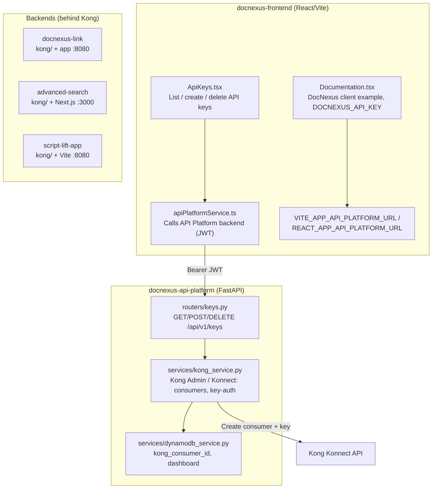

| Repo | Role | Key files for API keys / Kong |
|------|------|-------------------------------|
| **docnexus-frontend** | Dashboard UI: manage keys, docs | `src/pages/Dashboard/ApiPlatform/ApiKeys.tsx`, `Documentation.tsx`, `src/services/apiPlatformService.ts`; env: `VITE_APP_API_PLATFORM_URL` or `REACT_APP_API_PLATFORM_URL` |
| **docnexus-api-platform** | Backend: create/list/delete keys in Kong, store consumer id | `app/routers/keys.py`, `app/services/kong_service.py`, `app/services/dynamodb_service.py`; env: `API_PLATFORM_KONG_ADMIN_URL`, `API_PLATFORM_KONG_KONNECT_REALM_ID`, etc. |
| **docnexus-link** | Backend API | `kong/` (mTLS proxy, certs, README); route `/docnexus-link` → :8080 |
| **advanced-search** | Backend API | `kong/`; route `/advanced-search` → :3000 |
| **script-lift-app** | Backend API | `kong/`; route `/script-lift-app` → :8080 |

**API key creation flow (user creates a key in the dashboard):**

1. User is logged in to **docnexus-frontend** (Cognito).
2. User opens **API Platform → Keys** and clicks “Create key” (name, optional endpoints: script-lift, hcp-profiles, advanced-search).
3. **apiPlatformService** calls **docnexus-api-platform** `POST /api/v1/keys` with `Authorization: Bearer <Cognito id_token>`.
4. **docnexus-api-platform** ensures a Kong **Consumer** for that user (Konnect realm API or Kong Admin), then creates a **key-auth credential** for that consumer; stores `kong_consumer_id` in DynamoDB.
5. The new key value is returned **once** to the frontend and shown to the user (copy and use in `DOCNEXUS_API_KEY` or `apikey` header when calling the Kong Proxy URL).

---

## Production architecture (no local / no ngrok)

In production, Kong Konnect Data Plane runs in the cloud; backends are deployed on your infrastructure; no ngrok or localhost.

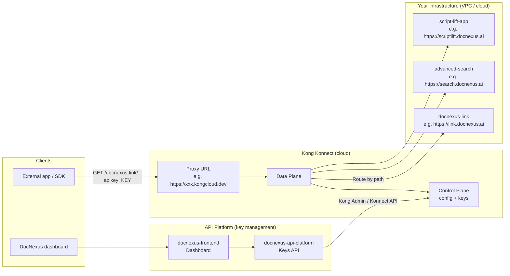

**Production request flow (API call with key):**

1. **Client** (external app or script) sends a request to **Kong Proxy URL**, e.g. `https://xxx.kongcloud.dev/docnexus-link/v5/search`, with header `apikey: <KEY>` or query `?apikey=<KEY>`.
2. **Kong Data Plane** (cloud) receives the request, matches **Route** (e.g. `/docnexus-link`), runs **key-auth**: validates the key against Konnect (Control Plane). If invalid or missing → **401 Unauthorized**.
3. If valid, Kong forwards to the **Service** upstream URL (production URL of the backend, e.g. `https://link.docnexus.ai`). Path is stripped per route config (e.g. `/docnexus-link/health` → upstream `/health`).
4. **Backend** (docnexus-link, advanced-search, or script-lift-app) receives the request **without** the API key (Kong does not forward it). Backend responds.
5. Response goes back: Backend → Kong → Client.

**Production optional mTLS:** If the Service URL in Kong is **HTTPS** and a **client certificate** is attached to the service, Kong sends that certificate when calling the backend. The backend (or an mTLS proxy in front of it) must then verify the client cert. In production the mTLS proxy (or TLS termination) would run on your servers, not locally.

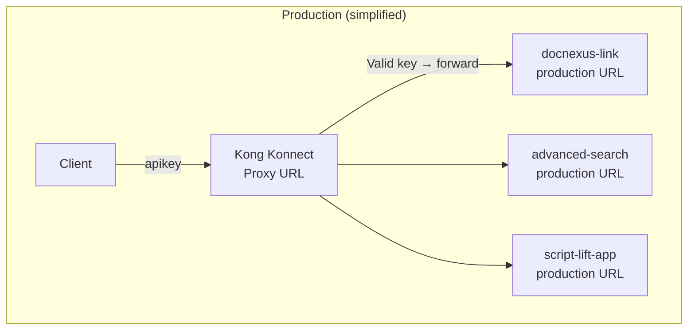

No ngrok, no localhost: Kong and backends use real hostnames and (optionally) private networking or public HTTPS.

---

## Request flow with mTLS enabled

When mTLS is turned on, Kong presents a **client certificate** when calling the backend; the backend (or an mTLS proxy in front of it) **verifies** that cert. Only Kong (holding that cert) can complete the TLS handshake and reach the app.

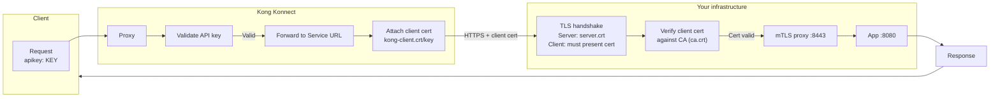

**Step-by-step (mTLS enabled):**

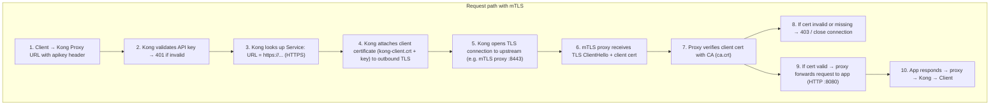

**What lives where (mTLS enabled):**

| Component | Role |
|-----------|------|
| **Kong (Control Plane)** | Stores **kong-client.crt** + **kong-client.key** as a Certificate entity; attached to the Service so the Data Plane uses them when calling the HTTPS upstream. |
| **Kong Data Plane** | Validates API key, then connects to Service URL over **HTTPS** and presents the client cert during TLS handshake. |
| **mTLS proxy (your server)** | Listens on **HTTPS** (:8443); uses **server.crt** + **server.key**; verifies client cert with **ca.crt**. Rejects (403) if no cert or cert not signed by CA. Proxies to app over HTTP. |
| **App (docnexus-link, etc.)** | Listens on HTTP (:8080); no TLS, no certs. Only reachable from the mTLS proxy (or directly if someone has network access). |

So with mTLS enabled: **only Kong** (with the client cert) can successfully call the mTLS proxy; direct calls to :8443 without a valid client cert get 403.

---

## Local / testing flow (Kong + optional ngrok + mTLS)

*Below is the **local development** setup: backends on localhost, optional ngrok for Konnect, optional mTLS proxy.*

## 1. Full request flow (API key + Kong + optional mTLS) — local

End-to-end path when a client calls the API through Kong Konnect with an API key. Option A = HTTP upstream (no mTLS); Option B = HTTPS upstream with mTLS.

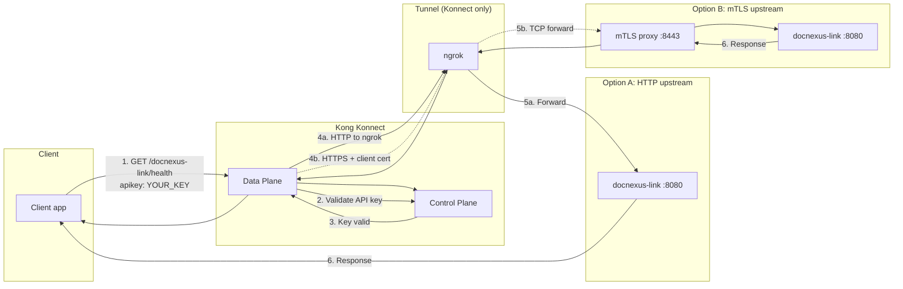

**Step-by-step (same flow, vertical):**

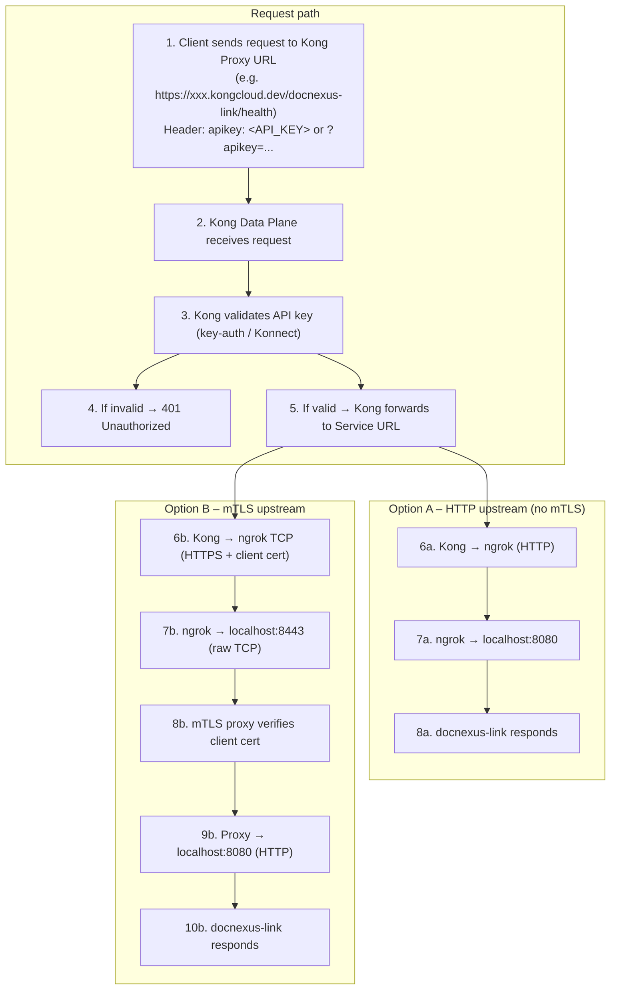

---

## 2. API key flow (where the key is checked)

Where the API key is validated and how it affects the request.

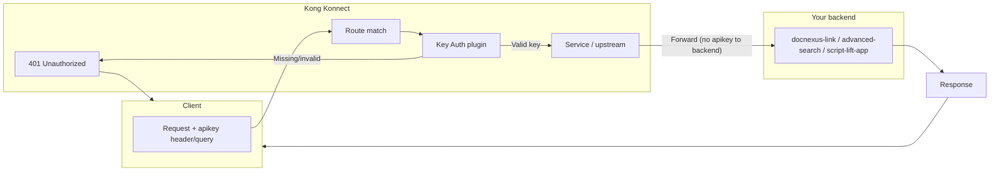

- **API key is only checked at Kong.** The backend (docnexus-link, etc.) does not see or validate the API key; Kong strips or does not forward it depending on config.
- Keys are created and stored in Kong Konnect (Control Plane). The Data Plane validates them before forwarding.

---

## 3. Before vs after Kong

**Before:** Clients call the backend directly. No central auth, no gateway.

**After:** All traffic goes through Kong. API key (and optionally mTLS) at the gateway.

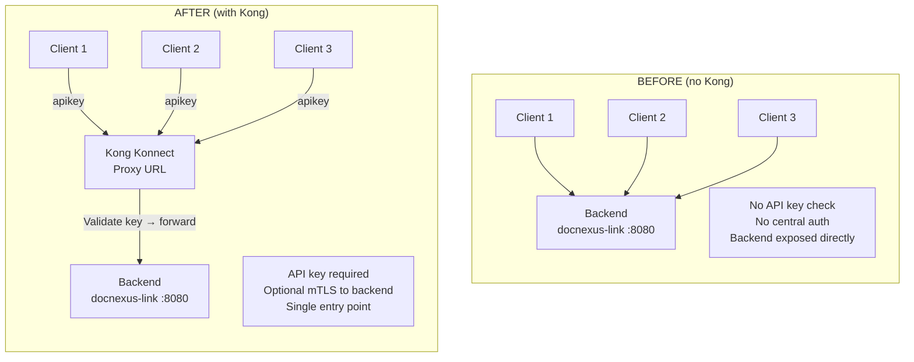

---

## 4. Before vs after (single-request view)

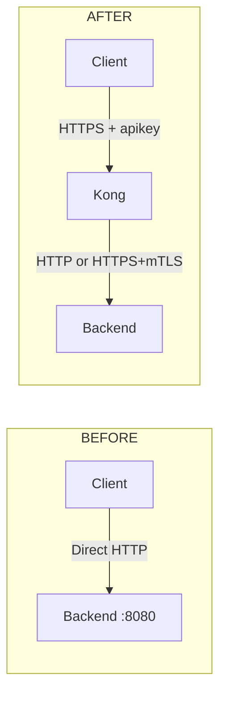

| | Before | After |
|---|--------|--------|
| **URL** | `http://backend:8080/health` | `https://&lt;proxy&gt;/docnexus-link/health` |
| **Auth** | None (or app-specific) | API key (header or query) validated by Kong |
| **Backend reachable** | By anyone who can reach :8080 | Only via Kong (optional: only Kong can reach via mTLS on 8443) |

---

## 5. Components summary

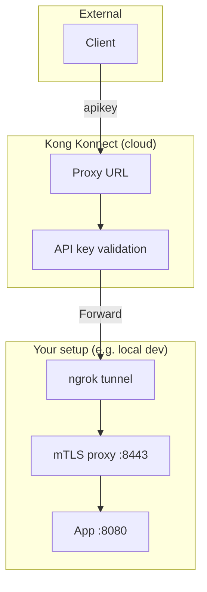

- **API key:** Checked only at Kong; backend does not see it.
- **mTLS:** Used only between Kong and your mTLS proxy (Option B); only Kong holds the client cert, so only Kong can call the backend via 8443.

---

## Summary table: production vs local

| Aspect | Production | Local / testing |
|--------|------------|------------------|
| **Kong** | Konnect Data Plane in cloud; Proxy URL e.g. `https://xxx.kongcloud.dev` | Same Konnect, or Kong running locally (e.g. Docker) |
| **Backends** | Deployed (e.g. ECS, K8s, Lambda); URLs like `https://link.docnexus.ai` | `localhost:8080`, `:3000`, `:8080`; optional **ngrok** to expose for Konnect |
| **mTLS** | Optional: Kong → HTTPS + client cert to your backend (or mTLS proxy in front of backend) | Optional: Kong → ngrok **TCP** → mTLS proxy :8443 → app |
| **Key management** | Same: docnexus-frontend (Dashboard) → docnexus-api-platform → Kong Konnect API | Same |
| **Frontend** | docnexus-frontend deployed; users open Dashboard → API Platform → Keys | Same app, often `localhost`; env `VITE_APP_API_PLATFORM_URL` points to api-platform backend |
